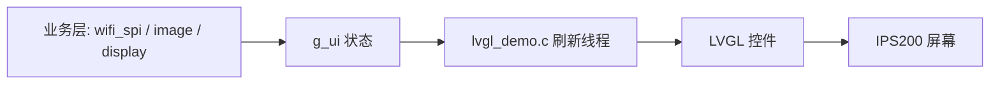
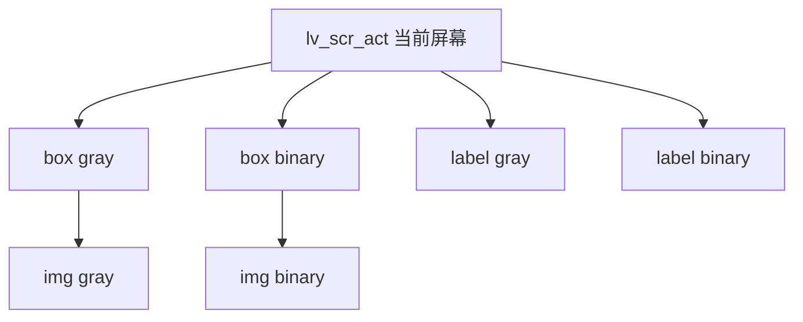
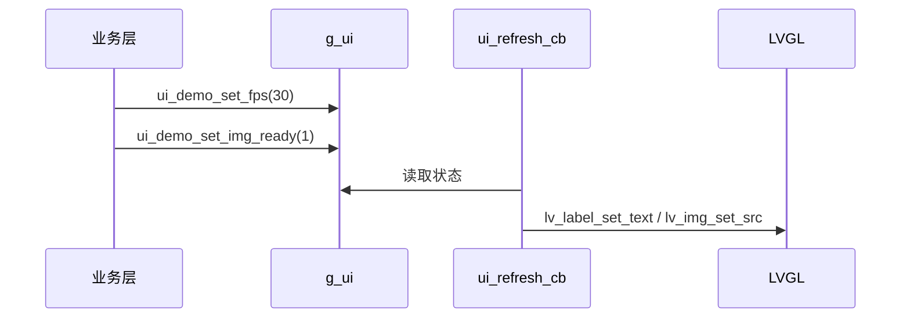
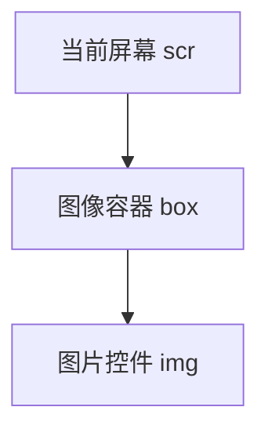
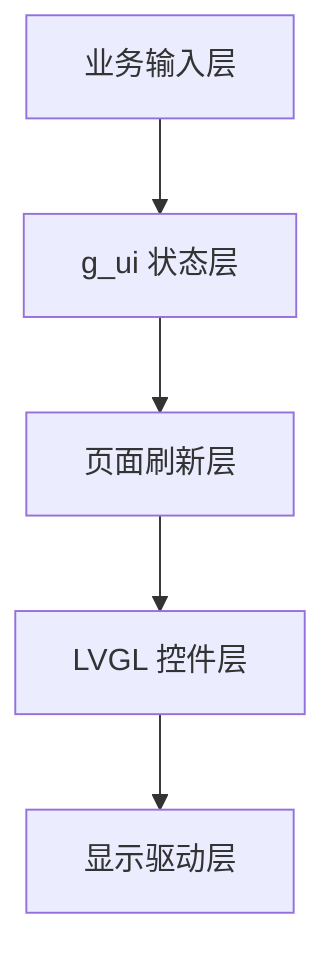

# LVGL 小白入门笔记

> 这是给第一次碰 `LVGL` 的你写的，目标不是“看懂一点点”，而是“看完能自己改这份小车工程的 UI”。


---

## 0. 先说结论

这份工程的 UI 不是“到处写 `lv_label_set_text`”那种散装写法，而是一个很明确的结构：

- `code/lvgl_demo.h` 定义“外部能调用什么”
- `code/lvgl_demo.c` 真正创建和刷新界面
- `code/init.c` 负责上电流程，先初始化，再切页面
- `code/wifi_spi.c`、`code/display.c`、`code/image.c` 负责业务数据
- 业务层只改 `g_ui`，UI 层每 `100ms` 看一次 `g_ui` 再刷新屏幕

你可以把它理解成：

- 业务层：我有个状态
- UI 层：我看状态决定画什么

这就是“传参输出”的核心思想。

---

## 1. 这工程到底在干嘛

这是一套跑在 TC264 上的车载小屏 UI。

它大致做三件事：

1. 开机初始化时显示“当前初始化进度”
2. 进入主界面后显示图像、菜单、状态
3. 业务模块只负责把数据塞进 `g_ui`，不直接碰 LVGL 控件

这样写的好处很大：

- 业务代码不会和 UI 代码缠成一团
- 切页面时不会到处改控件
- 后面你自己加页面，会比较稳



---

## 2. LVGL 是什么

`LVGL` 是一个嵌入式图形库。

你可以把它理解成：

- `label`：显示文字
- `img`：显示图片
- `btn`：按钮
- `bar`：进度条
- `obj`：最基础的容器/盒子

LVGL 的核心思路是：

1. 先创建对象
2. 再设置属性
3. 再让它显示在屏幕上
4. 后续修改对象属性，界面就跟着变

不是你每次都“重画整张屏”，而是改对象状态。

---

## 3. 先看本工程的文件分工

### 3.1 `code/lvgl_demo.h`

这个头文件负责：

- 定义页面状态结构体
- 对外声明 `g_ui`
- 对外声明 UI 接口函数

你可以把它看成“UI 的说明书”。

### 3.2 `code/lvgl_demo.c`

这个源文件负责：

- 初始化 LVGL
- 创建初始化页
- 创建演示页
- 每 100ms 刷新一次界面
- 根据 `g_ui` 画内容

这就是 UI 的主战场。

### 3.3 `code/init.c`

这个文件负责系统上电：

- 初始化硬件
- 初始化 LVGL
- 先显示初始化页
- 再切到主页面

### 3.4 `code/wifi_spi.c`

这个文件负责 WIFI 和相关业务。

它不应该自己去创建控件，只应该调用：

- `ui_init_set_step`
- `ui_init_set_result`
- `ui_demo_set_wifi_ok`

### 3.5 `code/image.c`

这个文件负责图像处理：

- 灰度图转二值图
- 找线
- 算阈值

它处理完后，把结果写进图像数组，UI 再拿去显示。

```mermaid
flowchart TB
    P[上电] --> I[init.c]
    I --> L[lvgl_init]
    I --> W[WIFI 初始化]
    I --> C[摄像头初始化]
    I --> S[ui_switch_page(PAGE_DEMO)]
    S --> D[演示页]
```

---

## 4. LVGL 的最小心智模型

初学者最容易乱的地方，是以为 UI 跟普通 C 程序一样“画一次就结束”。

其实 LVGL 是状态驱动的。

### 4.1 先有对象

比如：

```c
lv_obj_t *label = lv_label_create(lv_scr_act());
```

意思是：

- 在当前屏幕上创建一个标签

### 4.2 再设内容

```c
lv_label_set_text(label, "hello");
```

意思是：

- 这个标签现在显示 hello

### 4.3 再设位置

```c
lv_obj_align(label, LV_ALIGN_TOP_MID, 0, 20);
```

意思是：

- 把它放到屏幕上方中间，偏移 20 像素

### 4.4 改状态就会变

如果你后面再写：

```c
lv_label_set_text(label, "world");
```

那它就从 hello 变成 world。

这就是 LVGL 的基本玩法。

### 4.5 一张图看懂对象关系



---

## 5. 本工程的“传参输出”思想

你说的“传参输出”，在这工程里更像是：

- 外部模块把参数传给 UI 接口
- UI 接口把参数写进 `g_ui`
- 刷新线程根据 `g_ui` 输出到屏幕

不是函数直接把值返回给你，而是“通过状态传递，最终显示出来”。

比如：

```c
ui_demo_set_fps(30);
```

这句不是“立即画出 fps:30”，而是：

- 把 `30` 存进 `g_ui.demo.fps_val`
- 下次 UI 刷新时，`page_demo_refresh()` 读到它
- 再把它显示出来

这是一种很常见的嵌入式 UI 结构。

```c
// 业务层
ui_demo_set_fps(30);
ui_demo_set_img_ready(1);

// UI 层 100ms 后读到
// g_ui.demo.fps_val = 30
// g_ui.demo.img_ready = 1
```

---

## 6. `g_ui` 是什么

`g_ui` 是全局 UI 状态中心。

在 `code/lvgl_demo.h` 里你能看到它的定义结构，里面大体有两块：

- `init`：初始化页状态
- `demo`：演示页状态

### 6.1 `init`

保存初始化页要显示的内容，比如：

- 当前模块名
- 当前步骤
- 总步骤数
- 成功/失败

### 6.2 `demo`

保存演示页要显示的内容，比如：

- 当前子页
- 菜单选项
- WIFI 状态
- 帧率
- 图像是否更新

你以后自己扩 UI，第一反应应该是：

“这个状态应该放进 `g_ui` 的哪里？”

---

## 7. 页面切换是怎么做的

在 `code/lvgl_demo.c` 里有：

```c
void ui_switch_page(int new_page)
```

它做三件事：

1. 清空当前屏幕
2. 修改 `g_ui.page`
3. 调用 `lvgl_demo()` 重建页面

这个流程非常重要。

也就是说，页面不是靠“隐藏一堆控件”硬撑着切换的，而是：

- 旧页面清掉
- 新页面创建出来

这比“堆一堆对象再互相藏”更稳。

---

## 8. 初始化页怎么工作的

初始化页在 `page_init_create()` 里创建。

它有这些对象：

- 顶部标题 `System Init`
- 中间粉色状态字
- 步骤文字
- 底部进度条

刷新时走 `page_init_refresh()`：

- 看 `wifi_stage`
- 看 `wifi_result`
- 决定显示什么文字

例如：

- `WIFI SPI Init...`
- `WIFI Connect OK`
- `CAM FAIL`
- `ALL READY!`

这就是一个典型的“状态机 + UI 输出”。

---

## 9. 演示页现在怎么工作的

你现在这份 demo 页已经被我整理成比较干净的结构了。

它只保留：

- 左侧灰度图
- 右侧二值图
- 两个标题：`gray` 和 `binary`

不再画：

- `main`
- `data`
- `tuning`
- `wifi ok/fail`
- `fps`

你可以把现在的演示页理解成“最小可用图像页”：

- 左图负责显示原图
- 右图负责显示处理后的图
- 标题只做视觉提示

这样你就先把“图像显示”这件事单独跑通了。

这是为了避免你现在看见一堆旧 UI 叠在一起。

### 9.1 创建

`page_demo_create()`：

- 先 `lv_obj_clean(scr)`
- 创建两个图容器
- 创建两张 `lv_img`
- 创建两个标题

### 9.2 刷新

`page_demo_refresh()`：

- 如果 `g_ui.demo.img_ready` 或 `mt9v03x_finish_flag` 为真
- 重新 `lv_img_set_src`
- 让 LVGL 重绘图像

---

## 10. 这份工程里最重要的几个接口

### 10.1 `lvgl_init()`

作用：

- 初始化 LVGL
- 初始化显示驱动
- 创建 100ms 刷新定时器

### 10.2 `lvgl_demo()`

作用：

- 按 `g_ui.page` 创建对应页面

### 10.3 `ui_switch_page(int new_page)`

作用：

- 清屏
- 切页
- 重建页面

### 10.4 `ui_init_begin(int total_modules)`

作用：

- 告诉 UI 一共有几个初始化模块

### 10.5 `ui_init_set_module(const char *module_name, int module_steps)`

作用：

- 切换当前初始化模块

### 10.6 `ui_init_set_step(const char *step_text, int step_index)`

作用：

- 更新当前步骤文字

### 10.7 `ui_init_set_result(int success)`

作用：

- 设置模块成功或失败
- 推进大进度条

### 10.8 `ui_demo_set_fps(int fps)`

作用：

- 设置帧率

### 10.9 `ui_demo_set_img_ready(int ready)`

作用：

- 告诉 UI 新图像准备好了

### 10.10 接口怎么串起来



---

## 11. 业务层怎么把数据“传给”UI

你可以理解成四步：

1. 业务模块算出结果
2. 调 UI 接口
3. UI 接口写进 `g_ui`
4. 定时刷新函数显示出来

例如：

```c
ui_demo_set_fps(27);
ui_demo_set_img_ready(1);
```

这表示：

- 帧率是 27
- 有新图像了

UI 线程随后会把它显示在屏幕上。

---

## 12. 怎么从 0 开始看懂这工程

你别急着看所有代码。

按这个顺序最稳：

### 第一步：先看头文件

先看：

- `code/lvgl_demo.h`

重点盯这几样：

- `ui_state_t`
- `g_ui`
- 对外接口声明

### 第二步：看初始化流程

看：

- `code/init.c`

重点看：

- 什么时候 `lvgl_init()`
- 什么时候 `lvgl_demo()`
- 什么时候切到 `PAGE_DEMO`

### 第三步：看 UI 主文件

看：

- `code/lvgl_demo.c`

重点看：

- `lvgl_init`
- `ui_refresh_cb`
- `ui_switch_page`
- `page_init_create`
- `page_init_refresh`
- `page_demo_create`
- `page_demo_refresh`

### 第四步：看业务模块怎么调用

看：

- `code/wifi_spi.c`
- `code/image.c`

重点看：

- 哪些地方调用了 `ui_*`

---

## 13. LVGL 的常用对象

### 13.1 `lv_obj`

基础容器。

你可以给它设置：

- 大小
- 位置
- 背景
- 边框

### 13.2 `lv_label`

显示文字。

常见接口：

```c
lv_label_create(parent);
lv_label_set_text(label, "text");
```

### 13.3 `lv_img`

显示图片。

常见接口：

```c
lv_img_create(parent);
lv_img_set_src(img, &dsc);
```

### 13.4 `lv_bar`

进度条。

常见接口：

```c
lv_bar_create(parent);
lv_bar_set_value(bar, value, LV_ANIM_ON);
```

---

## 14. LVGL 对象树是什么

LVGL 不是每个控件都独立存在，它有“父子关系”。

比如：

```c
lv_obj_t *box = lv_obj_create(scr);
lv_obj_t *img = lv_img_create(box);
```

这表示：

- `img` 是 `box` 的子对象

如果你清掉 `box`，它下面的子对象也会跟着没。

这个规则很重要。

---

## 15. 为什么要 `lv_obj_clean`

`lv_obj_clean(scr)` 的意思是：

- 清掉这个屏幕上的所有对象

它适合切页时用。

这样做的好处：

- 不会留下上一页残影
- 不会重复创建对象
- 逻辑比较干净

---

## 16. 为什么你会看到“重叠”

通常有四种原因：

1. 旧页面没清掉
2. 同一个页面被重复创建
3. 业务层在别处也在直接画旧 UI
4. 刷新函数还在改已经不该存在的对象

你这次图里那种感觉，最像前两种。

---

## 17. 本工程现在推荐的改法

我建议你把 UI 分成两层：

- 结构层：页面创建和布局
- 数据层：业务状态输入

以后你改 UI，尽量遵守这个套路：

1. 先改 `g_ui`
2. 再改 `page_*_refresh`
3. 尽量少让业务层直接碰 LVGL 对象

这样以后不容易炸。

---

## 18. 你自己纯手写一个小车 UI 的顺序

如果从零重写，我建议你按这个顺序：

### 18.1 先做最小页面

先只做：

- 一个标题
- 一个状态字
- 一个进度条

### 18.2 再加初始化状态

做：

- `Step 1 / 4`
- `OK / FAIL`

### 18.3 再加演示页

做：

- 一张图
- 两张图
- 帧率

### 18.4 再加页面切换

做：

- `PAGE_INIT`
- `PAGE_DEMO`

### 18.5 再加业务数据

把 WIFI、摄像头、找线、阈值这些状态，逐个接入 `g_ui`

### 18.6 建议你按这个里程碑练

1. 只显示一行文字
2. 只显示一张图
3. 一图一文
4. 加页面切换
5. 加初始化页
6. 加多状态显示
7. 加业务驱动刷新

每一步都比“直接做完整车机 UI”更容易成功。

---

## 19. 手写 UI 时最容易犯的错

### 错误 1：业务代码直接画屏

不要让 `wifi_spi.c` 直接创建控件。

### 错误 2：页面对象重复建

每次切页前记得清理旧对象。

### 错误 3：刷新函数里乱改父对象

尽量固定对象层次。

### 错误 4：状态没统一

不要一部分状态存在局部变量，一部分存在全局。

### 错误 5：图像缓冲和显示对象混着改

图像数据和 `lv_img` 对象是两回事。

---

## 20. 图像显示怎么理解

你工程里的图像不是“直接拷贝成图片文件”，而是：

- 摄像头给出原始数组
- `image.c` 处理后生成二值图数组
- `lv_img_dsc_t` 只是告诉 LVGL 去哪里读数据

这意味着：

- 你改数组内容，下一次显示就变
- 不需要每次都重新申请大块图片资源

---

## 21. `lv_img_dsc_t` 是什么

它是图片描述符。

简单理解：

- 告诉 LVGL 图片宽多少
- 高多少
- 格式是什么
- 数据在哪

你现在看到的两个图：

- `s_demo_gray_dsc`
- `s_demo_binary_dsc`

本质都是“描述原始图像数据”的小结构。

---

## 22. 为什么要 100ms 刷新

`ui_refresh_cb` 每 100ms 跑一次。

这样做有几个原因：

- 不需要业务代码自己刷屏
- UI 更新节奏稳定
- 不会因为某个模块阻塞而完全卡死

你可以把它理解成：

- UI 有自己的“心跳”

---

## 23. 如果你想继续扩展

以后你可以往 `g_ui` 里继续加：

- 电机状态
- 电池电压
- 蓝牙状态
- 车速
- 路线模式
- 阈值参数

然后在刷新函数里对应显示。

这就是“状态驱动 UI”的自然扩展方式。

---

## 24. 推荐你先掌握的 LVGL API

先把这几个吃透：

- `lv_obj_create`
- `lv_label_create`
- `lv_label_set_text`
- `lv_img_create`
- `lv_img_set_src`
- `lv_bar_create`
- `lv_bar_set_value`
- `lv_obj_align`
- `lv_obj_set_pos`
- `lv_obj_set_size`
- `lv_obj_clean`

这些够你写很多基础 UI 了。

---

## 25. 读代码时的建议顺序

你可以一边看一边做笔记：

1. `g_ui` 里有哪些状态
2. 每个状态是谁在改
3. 刷新函数怎么读这些状态
4. 最终屏幕上怎么显示

这条线理顺，你就真的入门了。

---

## 26. 你现在最该记住的一句话

> 业务只管改状态，UI 只管读状态。

这句话你先记住，后面整个工程都会顺很多。

---

## 27. 之后你可以自己动手改什么

你可以先试这些小改动：

- 把左上角标题换成车名
- 把图像位置再微调
- 给初始化页加更多步骤文字
- 给 demo 页加电压显示
- 做一个纯文本状态页

每改一个点，都按“状态输入 -> 刷新输出”来想。

---

## 28. 结尾

这份工程本质上已经给你搭好了骨架。

你接下来要做的，不是一下子把所有 LVGL 都吃掉，而是：

- 先看懂状态流
- 再看懂页面流
- 再自己加一小块 UI
- 最后慢慢替换成你想要的整套车载界面

你已经到能开始真正改 UI 的阶段了。

---

## 29. 第二部分：真正认识 LVGL 库

前面讲的是“我们这份工程怎么用 LVGL”。

这一部分开始，我们认真讲 LVGL 本身。

你可以把 LVGL 当成一个小型 UI 操作系统。

它管理：

- 屏幕
- 控件
- 控件之间的父子关系
- 控件样式
- 控件事件
- 定时刷新
- 显示缓冲
- 输入设备

所以你不是在“画几个字”，你是在维护一个界面对象世界。

### 29.1 LVGL 的入口

任何 LVGL 工程都离不开：

```c
lv_init();
```

这句表示：

- 初始化 LVGL 内部系统
- 准备对象管理
- 准备样式系统
- 准备内存系统

但只调用 `lv_init()` 还不够。

你还要告诉 LVGL：

- 屏幕怎么刷
- 时间怎么走
- 什么时候处理任务

### 29.2 本工程里的入口

在我们的工程里，入口大概是：

```c
void lvgl_init(void)
{
    lv_init();
    lv_port_disp_init();
    s_ui_refresh_tmr = lv_timer_create(ui_refresh_cb, 100, NULL);
}
```

这一段可以拆成三层：

- `lv_init()`：启动 LVGL
- `lv_port_disp_init()`：接上 IPS200 显示屏
- `lv_timer_create(...)`：创建 UI 定时刷新

你如果以后从 0 手写，也基本逃不开这个顺序。

### 29.3 LVGL 需要 tick

LVGL 需要知道时间在走。

所以工程里有：

```c
pit_ms_init(CCU60_CH0, 10);
```

注释里写得很关键：

```c
// CCU60 中断里调 lv_tick_inc(10)，LVGL tick 才会走
```

也就是说：

- 定时器每 10ms 进一次中断
- 中断里告诉 LVGL：时间过去了 10ms

如果 tick 不走，动画、定时器、刷新节奏都可能异常。

### 29.4 LVGL 需要 handler

除了 tick，还需要定期调用：

```c
lv_task_handler();
```

在 LVGL 8 里它也常被叫作：

```c
lv_timer_handler();
```

你的工程里 `delay_with_refresh_ms()` 会在阻塞等待时不断调用 `lv_task_handler()`。

这非常重要。

因为嵌入式程序经常会有等待：

- 等 WIFI
- 等摄像头
- 等模块回应
- 等延时

如果等待期间不处理 LVGL，屏幕看起来就会卡。

---

## 30. LVGL 的对象树

LVGL 的核心是对象树。

最顶层对象是当前屏幕：

```c
lv_obj_t *scr = lv_scr_act();
```

`scr` 就是当前活跃屏幕。

你后面创建的对象，一般都挂在它下面：

```c
lv_obj_t *label = lv_label_create(scr);
```

这表示：

- 在当前屏幕上创建一个文字控件

### 30.1 父对象和子对象

如果你写：

```c
lv_obj_t *box = lv_obj_create(scr);
lv_obj_t *img = lv_img_create(box);
```

那就是：

- `scr` 是 `box` 的父对象
- `box` 是 `img` 的父对象
- `img` 是 `box` 的子对象

对象树大概这样：



### 30.2 清屏为什么有效

如果你调用：

```c
lv_obj_clean(scr);
```

意思是：

- 清掉 `scr` 的所有子对象

也就是：

- 页面上的控件全部删除
- 子对象跟着删除

所以切页时很适合用它。

### 30.3 删除对象要小心

如果你删除了一个对象，但后面还拿旧指针去刷新，就会很危险。

比如：

```c
lv_obj_del(label);
lv_label_set_text(label, "oops");
```

这就是典型错误。

所以工程里要保证：

- 当前页面有哪些对象
- 刷新函数只刷新当前页面存在的对象

---

## 31. LVGL 的坐标系统

LVGL 里坐标一般是：

- 左上角为原点
- x 向右增加
- y 向下增加

比如：

```c
lv_obj_set_pos(obj, 10, 20);
```

意思是：

- 对象左上角放到 x=10, y=20

### 31.1 `lv_obj_set_pos`

这是直接定位。

适合：

- 小屏幕
- 固定布局
- 嵌入式仪表
- 你这种 240x320 小屏

### 31.2 `lv_obj_align`

这是相对屏幕或父对象对齐。

比如：

```c
lv_obj_align(label, LV_ALIGN_TOP_MID, 0, 20);
```

表示：

- 顶部居中
- x 偏移 0
- y 偏移 20

### 31.3 `lv_obj_align_to`

这是相对另一个对象对齐。

比如：

```c
lv_obj_align_to(title, box, LV_ALIGN_OUT_TOP_MID, 0, -2);
```

表示：

- 把标题放在 box 的上方中间

这在“标题跟随图像容器”时很好用。

---

## 32. LVGL 的样式系统

样式就是控件的外观。

常见样式函数长这样：

```c
lv_obj_set_style_text_color(label, lv_color_hex(0xFF3366), 0);
lv_obj_set_style_border_width(box, 0, 0);
lv_obj_set_style_bg_opa(box, LV_OPA_TRANSP, 0);
```

你会发现它们都有类似结构：

```c
lv_obj_set_style_属性名(对象, 值, selector);
```

最后那个 `0` 可以先理解成“默认状态”。

### 32.1 文字颜色

```c
lv_obj_set_style_text_color(label, lv_color_hex(0xFF0000), 0);
```

显示红色文字。

### 32.2 背景透明

```c
lv_obj_set_style_bg_opa(obj, LV_OPA_TRANSP, 0);
```

让对象背景透明。

### 32.3 边框宽度

```c
lv_obj_set_style_border_width(obj, 0, 0);
```

去掉边框。

你之前说的蓝框，就是边框样式导致的。

### 32.4 字体

```c
lv_obj_set_style_text_font(label, &lv_font_montserrat_14, 0);
```

指定字体。

小屏幕上字体很关键，因为字太大就挤，字太小又看不清。

---

## 33. LVGL 的显示刷新

LVGL 不等于每句代码都立刻刷屏。

它内部会标记对象“脏了”，然后在合适的时候刷新。

比如：

```c
lv_label_set_text(label, "new");
```

这会让 LVGL 知道：

- 这个 label 内容变了
- 下一轮刷新需要重绘

### 33.1 本工程的刷新方式

本工程有一个 100ms UI 定时器：

```c
s_ui_refresh_tmr = lv_timer_create(ui_refresh_cb, 100, NULL);
```

每 100ms 调：

```c
ui_refresh_cb()
```

它会根据当前页面刷新对应内容。

### 33.2 为什么不是每帧都重建页面

因为重建页面会：

- 删除对象
- 创建对象
- 重新设置样式
- 消耗更多 CPU
- 更容易出现叠层或指针问题

所以一般：

- 页面创建函数只创建一次
- 页面刷新函数只更新数据

这是你写 LVGL 时一定要记住的原则。

---

## 34. 本工程的 UI 分层

我们的工程可以分成四层：



### 34.1 业务输入层

比如：

- WIFI 连接结果
- 摄像头帧完成
- 图像处理完成
- 按键选择变化

这些都属于业务层。

### 34.2 `g_ui` 状态层

比如：

- `g_ui.page`
- `g_ui.demo.img_ready`
- `g_ui.demo.fps_val`
- `g_ui.init.cur.step`

它们记录界面当前应该显示什么。

### 34.3 页面刷新层

比如：

- `page_init_refresh`
- `page_demo_refresh`

它们负责把状态变成控件内容。

### 34.4 LVGL 控件层

比如：

- `s_wifi_title`
- `s_wifi_bar`
- `s_demo_img_gray`
- `s_demo_img_binary`

这些是真正的屏幕对象。

### 34.5 显示驱动层

比如：

- `lv_port_disp_init`
- IPS200 底层刷屏接口

这层负责把 LVGL 画好的内容送到屏幕。

---

## 35. 怎么自己从 0 手写一个最小 UI

现在开始写实战。

### 35.1 第一步：初始化 LVGL

你需要：

```c
lv_init();
lv_port_disp_init();
```

如果没有这两步，后面创建控件没有意义。

### 35.2 第二步：创建当前屏幕对象

```c
lv_obj_t *scr = lv_scr_act();
```

这不是创建新屏幕，而是拿到当前活跃屏幕。

### 35.3 第三步：创建一个文字

```c
lv_obj_t *label = lv_label_create(scr);
lv_label_set_text(label, "hello car");
lv_obj_align(label, LV_ALIGN_TOP_MID, 0, 20);
```

这就是最小 UI。

### 35.4 第四步：加一个进度条

```c
lv_obj_t *bar = lv_bar_create(scr);
lv_obj_set_size(bar, 180, 12);
lv_obj_align(bar, LV_ALIGN_BOTTOM_MID, 0, -20);
lv_bar_set_range(bar, 0, 100);
lv_bar_set_value(bar, 50, LV_ANIM_OFF);
```

现在你有：

- 一个文字
- 一个进度条

### 35.5 第五步：加刷新函数

不要每次都创建控件。

你应该这样：

```c
static lv_obj_t *s_label;

static void page_create(void)
{
    s_label = lv_label_create(lv_scr_act());
}

static void page_refresh(void)
{
    lv_label_set_text(s_label, "new text");
}
```

创建归创建，刷新归刷新。

---

## 36. 怎么手写我们的初始化页

初始化页需要这些东西：

- 标题
- 当前模块
- 当前步骤
- 进度条
- 成功失败颜色

### 36.1 先定义状态

```c
typedef struct
{
    char text[64];
    int step;
    int total;
    int ok;
} ui_init_module_t;
```

这表示当前模块：

- 显示什么字
- 第几步
- 一共几步
- 是否成功

### 36.2 创建控件

```c
s_wifi_title = lv_label_create(scr);
s_wifi_status = lv_label_create(scr);
s_wifi_step_lbl = lv_label_create(scr);
s_wifi_bar = lv_bar_create(scr);
```

### 36.3 刷新控件

```c
lv_label_set_text(s_wifi_status, text);
lv_label_set_text(s_wifi_step_lbl, tmp);
lv_bar_set_value(s_wifi_bar, pct, LV_ANIM_ON);
```

你看，刷新函数只改内容，不重新创建。

---

## 37. 怎么手写我们的图像页

图像页核心是 `lv_img_dsc_t`。

### 37.1 图像描述符

```c
s_demo_gray_dsc.header.w = MT9V03X_W;
s_demo_gray_dsc.header.h = MT9V03X_H;
s_demo_gray_dsc.header.cf = LV_IMG_CF_ALPHA_8BIT;
s_demo_gray_dsc.data_size = MT9V03X_W * MT9V03X_H;
s_demo_gray_dsc.data = (const uint8 *)mt9v03x_image[0];
```

它告诉 LVGL：

- 图片宽度
- 图片高度
- 图片格式
- 数据大小
- 数据地址

### 37.2 创建图片对象

```c
s_demo_img_gray = lv_img_create(s_demo_box_gray);
lv_img_set_src(s_demo_img_gray, &s_demo_gray_dsc);
```

图片对象只是控件。

图片数据在数组里。

### 37.3 刷新图片

```c
lv_img_set_src(s_demo_img_gray, &s_demo_gray_dsc);
```

这一步的意义是告诉 LVGL：

- 图像源还是这个描述符
- 但里面的数据可能变了
- 请重新绘制

---

## 38. 怎么自己加一个电压显示

假设你想显示电池电压。

### 38.1 先改状态结构体

在 `ui_demo_page_t` 里加：

```c
int battery_mv;
```

表示电池毫伏。

### 38.2 再加接口

在 `lvgl_demo.h` 里声明：

```c
void ui_demo_set_battery_mv(int mv);
```

在 `lvgl_demo.c` 里实现：

```c
void ui_demo_set_battery_mv(int mv)
{
    g_ui.demo.battery_mv = mv;
}
```

### 38.3 再创建 label

```c
static lv_obj_t *s_demo_battery_label;
```

创建时：

```c
s_demo_battery_label = lv_label_create(scr);
lv_obj_align(s_demo_battery_label, LV_ALIGN_TOP_LEFT, 4, 150);
```

### 38.4 刷新时显示

```c
char tmp[32];
snprintf(tmp, sizeof(tmp), "bat:%dmV", g_ui.demo.battery_mv);
lv_label_set_text(s_demo_battery_label, tmp);
```

这就是完整的“传参输出”。

业务层只需要：

```c
ui_demo_set_battery_mv(7400);
```

屏幕就会显示：

```text
bat:7400mV
```

---

## 39. 怎么自己加一个状态灯

你可以用 label 做一个简易状态灯。

比如：

```c
lv_label_set_text(label, "●");
```

然后改颜色：

```c
lv_obj_set_style_text_color(label, lv_color_hex(0x00FF00), 0);
```

绿色表示 OK。

红色表示 FAIL。

这比一开始就做复杂图标更适合小白。

---

## 40. 怎么避免页面叠层

页面叠层是你刚才遇到的问题。

常见原因：

- 页面创建函数被重复调用
- 切页前没清屏
- 旧显示函数还在跑
- 旧的裸屏显示函数还在直接画

解决原则：

- 切页时清屏
- 创建和刷新分开
- 业务层不要直接画屏
- 不要同时用 LVGL 和旧 IPS200 裸画同一块区域

尤其最后一句很重要。

如果 `display.c` 还在直接调用 `ips200_show_*`，它可能会和 LVGL 抢屏幕。

---

## 41. LVGL 和旧显示代码怎么共存

最理想的做法：

- 所有 UI 都走 LVGL
- 旧的 `ips200_show_*` 只作为底层驱动或调试用

不太建议：

- LVGL 画一半
- `display.c` 裸画一半

因为它们可能互相覆盖。

你如果非要共存，一定要分清：

- 哪块区域归 LVGL
- 哪块区域归裸画
- 谁先画
- 谁后画

小白阶段我建议直接统一走 LVGL。

---

## 42. 你接下来怎么继续写

建议你接下来按这个路线走：

1. 保持当前 demo 页只显示双图
2. 确认没有叠层
3. 再加一个 `fps` label
4. 确认不叠层
5. 再加一个电压 label
6. 确认不叠层
7. 再做菜单
8. 最后做完整小车 UI

这就像搭积木，一块一块放，别一口气全倒进去。

---

## 43. 小白最推荐背下来的模板

```c
static lv_obj_t *s_label;

static void page_create(void)
{
    lv_obj_t *scr = lv_scr_act();
    lv_obj_clean(scr);

    s_label = lv_label_create(scr);
    lv_label_set_text(s_label, "hello");
    lv_obj_align(s_label, LV_ALIGN_TOP_MID, 0, 20);
}

static void page_refresh(void)
{
    lv_label_set_text(s_label, "running");
}
```

这段模板你真的可以背。

因为很多 UI 都是它的变体。

---

## 44. 猫娘式总结一下

喵，LVGL 其实不是很凶。

它只是要求你按规矩来：

- 先创建对象
- 再设置样式
- 再传入状态
- 再统一刷新

不要让业务代码到处伸手画屏。

不要在刷新函数里疯狂创建对象。

不要忘记切页清屏。

你只要守住这三条，界面就会乖很多。

---

## 45. 以后这篇笔记可以继续扩什么

后续可以继续加：

- LVGL 常用控件完整例子
- 小车仪表盘页面
- 参数调试页面
- 摄像头调参页面
- 菜单系统
- 按键事件系统
- 字体和中文显示
- 图片资源制作
- 页面管理器
- 状态机设计

这篇现在是第一版。

后面可以继续把它扩成真正的“小车 LVGL 手写 UI 教程书”。

---

## 46. 第三部分：几十个我们还没用过、但很值得认识的 LVGL 组件

前面我们主要用了：

- `lv_label`
- `lv_img`
- `lv_bar`
- `lv_obj`
- `lv_timer`

但 LVGL 的组件远不止这些。

这一章专门介绍一些我们工程现在还没大规模用起来、但以后做小车 UI 很可能会用到的组件。

你不用一次全背下来。

先知道“它们能干什么”，以后需要时再查 API 就行。

---

## 47. `lv_btn` 按钮

按钮是最基础的交互控件。

虽然我们的板子主要靠实体按键，但如果以后做触摸屏，`lv_btn` 就会很常用。

### 47.1 适合用在哪里

- 设置页
- 参数保存
- 模式切换
- 开始/停止
- 确认/返回

### 47.2 最小例子

```c
lv_obj_t *btn = lv_btn_create(lv_scr_act());
lv_obj_set_size(btn, 80, 36);
lv_obj_align(btn, LV_ALIGN_CENTER, 0, 0);

lv_obj_t *label = lv_label_create(btn);
lv_label_set_text(label, "OK");
lv_obj_center(label);
```

### 47.3 小车工程里怎么用

比如以后你有触摸屏，可以做：

- `Start`
- `Stop`
- `Save`
- `Back`

实体按键版也可以借鉴它的“按钮状态”思想，只是输入来源不是触摸，而是按键扫描。

---

## 48. `lv_slider` 滑条

滑条适合调数值。

### 48.1 适合用在哪里

- 调阈值
- 调 PID 参数
- 调曝光
- 调速度上限
- 调舵机中值

### 48.2 最小例子

```c
lv_obj_t *slider = lv_slider_create(lv_scr_act());
lv_obj_set_width(slider, 180);
lv_obj_align(slider, LV_ALIGN_CENTER, 0, 0);
lv_slider_set_range(slider, 0, 100);
lv_slider_set_value(slider, 50, LV_ANIM_OFF);
```

### 48.3 小车工程里怎么用

比如调二值化阈值：

```c
lv_slider_set_range(slider, 0, 255);
lv_slider_set_value(slider, threshold, LV_ANIM_OFF);
```

如果你的屏幕不能触摸，也可以用按键模拟滑条：

- KEY1 减小
- KEY2 增大
- KEY3 保存

---

## 49. `lv_switch` 开关

开关适合表示开/关状态。

### 49.1 适合用在哪里

- WIFI 开关
- 图像发送开关
- 调试模式开关
- 自动发车开关
- 显示刷新开关

### 49.2 最小例子

```c
lv_obj_t *sw = lv_switch_create(lv_scr_act());
lv_obj_align(sw, LV_ALIGN_CENTER, 0, 0);
```

### 49.3 判断是否打开

```c
if (lv_obj_has_state(sw, LV_STATE_CHECKED)) {
    // switch on
}
```

### 49.4 小车工程里怎么用

比如做一个调试页：

- 显示图像：ON/OFF
- 发送 WIFI：ON/OFF
- 输出串口：ON/OFF

---

## 50. `lv_checkbox` 复选框

复选框适合多个选项同时打开。

### 50.1 适合用在哪里

- 是否显示 FPS
- 是否显示中心线
- 是否显示边线
- 是否显示阈值信息
- 是否启用调试输出

### 50.2 最小例子

```c
lv_obj_t *cb = lv_checkbox_create(lv_scr_act());
lv_checkbox_set_text(cb, "show fps");
lv_obj_align(cb, LV_ALIGN_TOP_LEFT, 10, 10);
```

### 50.3 小车工程里怎么用

你可以做一个“调试显示选项页”：

- `show fps`
- `show binary`
- `show line`
- `show threshold`

这样调车时非常舒服。

---

## 51. `lv_dropdown` 下拉框

下拉框适合从多个选项里选一个。

### 51.1 适合用在哪里

- 模式选择
- 赛道类型
- 摄像头模式
- 调参项选择
- 显示主题选择

### 51.2 最小例子

```c
lv_obj_t *dd = lv_dropdown_create(lv_scr_act());
lv_dropdown_set_options(dd, "normal\nfast\nsafe\ndebug");
lv_obj_align(dd, LV_ALIGN_TOP_MID, 0, 20);
```

### 51.3 小车工程里怎么用

比如你可以选择：

- `normal`
- `debug`
- `camera`
- `tuning`

触摸屏很适合下拉框。

按键屏也能做类似逻辑，但通常会自己写菜单。

---

## 52. `lv_roller` 滚轮

滚轮适合小屏幕选项切换。

### 52.1 适合用在哪里

- 调参项选择
- 页面选择
- 模式选择
- 数值档位选择

### 52.2 最小例子

```c
lv_obj_t *roller = lv_roller_create(lv_scr_act());
lv_roller_set_options(roller, "P\nI\nD\nSpeed\nServo", LV_ROLLER_MODE_NORMAL);
lv_obj_align(roller, LV_ALIGN_CENTER, 0, 0);
```

### 52.3 小车工程里怎么用

如果你要做一个参数页，可以让滚轮选择参数名：

- `P`
- `I`
- `D`
- `threshold`
- `exposure`

然后用按键调数值。

---

## 53. `lv_arc` 圆弧

圆弧适合做仪表盘。

### 53.1 适合用在哪里

- 速度表
- 电池电量
- 转向角度
- CPU 占用
- 模块进度

### 53.2 最小例子

```c
lv_obj_t *arc = lv_arc_create(lv_scr_act());
lv_obj_set_size(arc, 120, 120);
lv_arc_set_range(arc, 0, 100);
lv_arc_set_value(arc, 60);
lv_obj_align(arc, LV_ALIGN_CENTER, 0, 0);
```

### 53.3 小车工程里怎么用

可以做一个“电池圆环”：

```c
lv_arc_set_value(bat_arc, battery_percent);
```

这样比普通文字更直观。

---

## 54. `lv_meter` 仪表

`lv_meter` 比 `lv_arc` 更像真正的仪表盘。

### 54.1 适合用在哪里

- 速度表
- 舵机角度表
- 电池电压表
- 电机输出表

### 54.2 使用难度

它比 `lv_label`、`lv_bar` 难一些。

你需要理解：

- scale
- indicator
- needle
- tick

### 54.3 小车工程里怎么用

以后可以做一个“车况仪表盘页面”：

- 左边速度
- 右边电池
- 中间模式
- 下方状态

这个组件很适合“漂亮一点”的车机 UI。

---

## 55. `lv_chart` 图表

图表适合显示历史数据。

### 55.1 适合用在哪里

- 速度曲线
- 电池电压曲线
- 误差曲线
- PID 输出曲线
- 摄像头帧率曲线

### 55.2 最小例子

```c
lv_obj_t *chart = lv_chart_create(lv_scr_act());
lv_obj_set_size(chart, 220, 120);
lv_obj_align(chart, LV_ALIGN_CENTER, 0, 0);
lv_chart_set_type(chart, LV_CHART_TYPE_LINE);
```

### 55.3 小车工程里怎么用

调 PID 时特别有用。

比如你可以显示：

- 偏差 error
- PID 输出
- 目标速度
- 实际速度

它会让调车更直观。

---

## 56. `lv_table` 表格

表格适合显示多行多列数据。

### 56.1 适合用在哪里

- 参数表
- 传感器状态表
- 模块初始化结果
- 调试变量列表

### 56.2 最小例子

```c
lv_obj_t *table = lv_table_create(lv_scr_act());
lv_table_set_cell_value(table, 0, 0, "name");
lv_table_set_cell_value(table, 0, 1, "value");
lv_table_set_cell_value(table, 1, 0, "fps");
lv_table_set_cell_value(table, 1, 1, "30");
```

### 56.3 小车工程里怎么用

可以做一个 debug 页面：

| name | value |
| --- | --- |
| fps | 30 |
| bat | 7.4V |
| wifi | ok |
| mode | run |

屏幕小的话，表格别做太大。

---

## 57. `lv_textarea` 文本输入框

文本输入框适合输入文字。

### 57.1 适合用在哪里

- WIFI 名称
- 调试命令
- 参数名
- 简单日志过滤

### 57.2 最小例子

```c
lv_obj_t *ta = lv_textarea_create(lv_scr_act());
lv_textarea_set_placeholder_text(ta, "input...");
lv_obj_set_size(ta, 180, 40);
lv_obj_align(ta, LV_ALIGN_TOP_MID, 0, 20);
```

### 57.3 小车工程里现实吗

如果没有触摸和键盘，它用处不大。

但如果以后接触摸屏，文本框可以做配置页。

---

## 58. `lv_keyboard` 屏幕键盘

屏幕键盘通常配合 `lv_textarea` 使用。

### 58.1 适合用在哪里

- 触摸屏输入
- WIFI 配置
- 参数命名

### 58.2 小车工程里怎么用

如果屏幕不是触摸屏，暂时不用它。

但你可以知道：

- 文本框负责显示输入内容
- 键盘负责输入字符

---

## 59. `lv_msgbox` 消息框

消息框适合弹出提示。

### 59.1 适合用在哪里

- 初始化失败
- WIFI 连接失败
- 参数保存成功
- 是否确认发车

### 59.2 小车工程里怎么用

比如初始化失败时弹：

```text
WIFI FAIL
Retry?
```

这比只在角落显示一行小字更醒目。

---

## 60. `lv_spinner` 加载动画

加载动画适合表示“正在等待”。

### 60.1 适合用在哪里

- WIFI 正在连接
- 摄像头正在初始化
- 正在保存参数
- 正在等待上位机

### 60.2 最小例子

```c
lv_obj_t *spinner = lv_spinner_create(lv_scr_act(), 1000, 60);
lv_obj_set_size(spinner, 48, 48);
lv_obj_center(spinner);
```

### 60.3 小车工程里怎么用

初始化页可以加一个小 spinner。

不过小屏幕资源有限，别动画太多。

---

## 61. `lv_led` LED 指示灯

`lv_led` 是软件里的小灯。

### 61.1 适合用在哪里

- WIFI 状态
- 摄像头状态
- 电机状态
- 调试开关状态

### 61.2 最小例子

```c
lv_obj_t *led = lv_led_create(lv_scr_act());
lv_obj_align(led, LV_ALIGN_TOP_RIGHT, -10, 10);
lv_led_on(led);
```

### 61.3 小车工程里怎么用

比 `wifi ok` 文字更省空间。

比如：

- 绿灯：正常
- 红灯：失败
- 灰灯：未启动

---

## 62. `lv_line` 线条

线条适合画简单图形。

### 62.1 适合用在哪里

- 分割线
- 车道线示意
- 中心线
- 简易坐标轴

### 62.2 最小例子

```c
static lv_point_t points[] = {{0, 0}, {100, 40}};
lv_obj_t *line = lv_line_create(lv_scr_act());
lv_line_set_points(line, points, 2);
```

### 62.3 小车工程里怎么用

你可以在图像旁边画：

- 中线偏移
- 目标方向
- 算法输出箭头

---

## 63. `lv_canvas` 画布

画布可以自己画像素、线、矩形等。

### 63.1 适合用在哪里

- 自定义图像显示
- 自定义曲线
- 自定义调试图
- 小车轨迹图

### 63.2 使用难度

比 `lv_img` 难。

因为你要准备画布缓冲区。

### 63.3 小车工程里怎么用

如果以后你想在屏幕上画：

- 车道线拟合
- 路径规划
- 转向预测

`lv_canvas` 会很有用。

---

## 64. `lv_tabview` 标签页

标签页适合多页面管理。

### 64.1 适合用在哪里

- main
- data
- tuning
- camera
- debug

### 64.2 小车工程里怎么用

如果是触摸屏，`lv_tabview` 很方便。

如果是按键屏，可能自己写页面切换更轻。

---

## 65. `lv_tileview` 平铺页面

`lv_tileview` 像一个可以滑动的页面网格。

### 65.1 适合用在哪里

- 横向滑动页面
- 上下切换状态页
- 多屏仪表

### 65.2 小车工程里怎么用

可以做：

- 左滑：图像页
- 右滑：参数页
- 上滑：状态页

不过没有触摸屏的话，用处会小一些。

---

## 66. `lv_list` 列表

列表适合显示一组选项。

### 66.1 适合用在哪里

- 设置菜单
- 模式菜单
- 参数菜单
- 调试菜单

### 66.2 小车工程里怎么用

比如调参页：

- camera exposure
- threshold
- speed kp
- speed ki
- servo mid

列表比自己手写多行 label 更有结构。

---

## 67. `lv_menu` 菜单

`lv_menu` 是更完整的菜单系统。

### 67.1 适合用在哪里

- 多级设置
- 系统配置
- 参数分类

### 67.2 小车工程里怎么用

如果以后你做完整车机设置页，可以考虑。

但小白阶段不建议一开始就上 `lv_menu`。

先用简单 label 菜单练熟。

---

## 68. `lv_win` 窗口

窗口控件适合带标题栏的小窗口。

### 68.1 适合用在哪里

- 调试浮窗
- 错误提示
- 参数编辑窗口

### 68.2 小车工程里怎么用

小屏幕上空间很紧，慎用。

但如果屏幕更大，它很好看。

---

## 69. `lv_animimg` 动画图片

动画图片可以在多张图片之间切换。

### 69.1 适合用在哪里

- 启动画面
- 连接动画
- 状态动画

### 69.2 小车工程里怎么用

比如 WIFI 连接时显示几帧动画。

但注意：

- 图片资源占内存
- 小车工程内存不算宽裕

---

## 70. `lv_imgbtn` 图片按钮

图片按钮是用图片当按钮。

### 70.1 适合用在哪里

- 图标式设置页
- 启动按钮
- 返回按钮

### 70.2 小车工程里怎么用

如果以后做触摸 UI，可以做图标按钮。

比如：

- 摄像头图标
- 参数图标
- 车速图标

---

## 71. `lv_colorwheel` 色轮

色轮用来选颜色。

### 71.1 适合用在哪里

- UI 主题调色
- 灯光颜色设置

### 71.2 小车工程里现实吗

目前不太需要。

但如果你做 RGB 灯光配置页面，可以用它。

---

## 72. `lv_calendar` 日历

日历用于日期选择。

### 72.1 小车工程里现实吗

基本用不到。

除非你做：

- 日志按日期查看
- 比赛记录管理

但嵌入式小车小屏上，一般不优先考虑。

---

## 73. `lv_spinbox` 数字调节框

数字调节框适合精确改数值。

### 73.1 适合用在哪里

- PID 参数
- 阈值
- 舵机中值
- 电机限幅
- 曝光时间

### 73.2 小车工程里怎么用

这个很适合调参。

比如：

```text
Kp: 1.25
```

按键控制：

- KEY1 选择位
- KEY2 增加
- KEY3 减少
- KEY4 保存

---

## 74. `lv_keyboard`、`lv_textarea`、`lv_spinbox` 的区别

这三个都和输入有关，但用途不同：

- `lv_textarea`：输入文本
- `lv_keyboard`：屏幕键盘
- `lv_spinbox`：输入数字

对小车来说：

- 数字参数优先用 `lv_spinbox`
- 普通选项优先用菜单
- 文本输入暂时少用

---

## 75. 哪些组件最适合我们的小车工程

优先级高：

- `lv_label`
- `lv_img`
- `lv_bar`
- `lv_arc`
- `lv_led`
- `lv_chart`
- `lv_table`
- `lv_slider`
- `lv_spinbox`
- `lv_list`

优先级中：

- `lv_btn`
- `lv_switch`
- `lv_checkbox`
- `lv_dropdown`
- `lv_roller`
- `lv_msgbox`
- `lv_spinner`

优先级低：

- `lv_calendar`
- `lv_colorwheel`
- `lv_keyboard`
- `lv_textarea`
- `lv_win`
- `lv_menu`
- `lv_tileview`

低优先级不是没用，而是对当前小车工程没那么急。

---

## 76. 组件选择口诀

显示文字：

- 用 `lv_label`

显示图片：

- 用 `lv_img`

显示进度：

- 用 `lv_bar`

显示电池/速度这种百分比：

- 用 `lv_arc`

显示 OK/FAIL：

- 用 `lv_led` 或彩色 `lv_label`

显示历史曲线：

- 用 `lv_chart`

显示很多参数：

- 用 `lv_table` 或 `lv_list`

调数值：

- 用 `lv_slider` 或 `lv_spinbox`

多页面：

- 小屏按键用自己写的 `PAGE_xxx`
- 触摸屏可以考虑 `lv_tabview`

---

## 77. 组件不要乱用

LVGL 组件很多，但不是越多越好。

小车 UI 要考虑：

- 屏幕小
- 内存小
- 刷新要快
- 操作要稳
- 比赛时不能花里胡哨挡视线

所以优先做：

- 清楚
- 稳定
- 好调试
- 好维护

漂亮可以后面再慢慢加。

---

## 78. 我建议我们下一步怎么扩 UI

按这个顺序最稳：

1. 当前双图页跑稳
2. 加 `lv_led` 显示 WIFI/CAM 状态
3. 加 `lv_label` 显示 FPS
4. 加 `lv_arc` 显示电池
5. 加 `lv_table` 做 debug 数据页
6. 加 `lv_spinbox` 做 PID 调参页
7. 加 `lv_chart` 显示误差曲线
8. 最后再做菜单系统

这条路线很适合从小白慢慢变成熟手。
